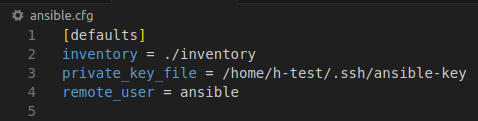
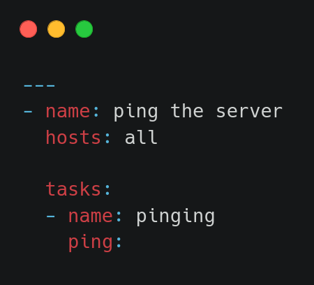
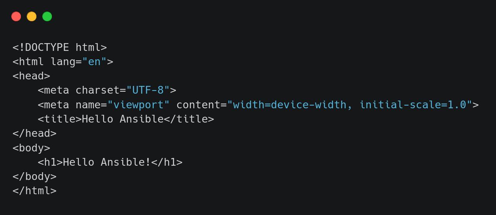
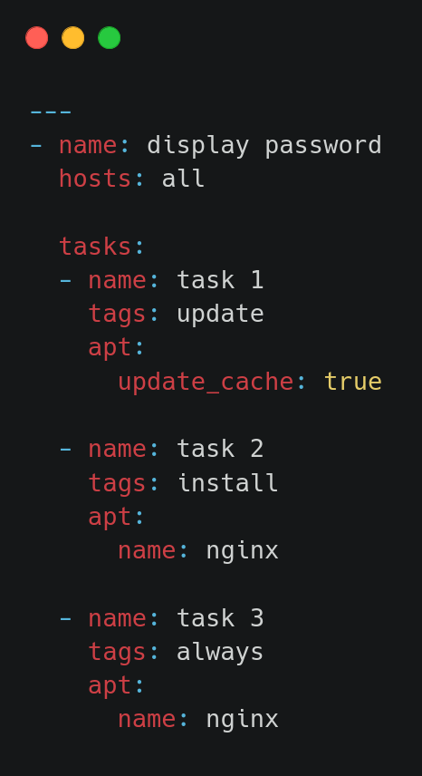

# Ansible Labs Documentation

This documentation provides step-by-step guides and examples for working with Ansible, covering various topics such as setting up the environment, practicing inventory management, configuration, playbooks, tasks, handlers, roles, and more.

## Table of Contents

1. [Setup Environment](#setup-environment)
2. [Practicing Inventory](#practicing-inventory)
3. [Practicing ansible.cfg](#practicing-ansiblecfg)
4. [Practicing Command Escalation (become)](#practicing-command-escalation-become)
5. [Practicing Playbook](#practicing-playbook)
6. [Install Nginx Task](#install-nginx-task)
7. [Practicing Tags](#practicing-tags)
8. [Always Tag](#always-tag)
9. [Practicing Variables](#practicing-variables)
10. [Practicing Loops](#practicing-loops)
11. [Practicing When](#practicing-when)
12. [Practicing Register](#practicing-register)
13. [Practicing Register & When](#practicing-register--when)
14. [Practicing Handler](#practicing-handler)
15. [Practicing Template](#practicing-template)
16. [Roles Project](#roles-project)


## Setup Environment

1. **Install Ansible on your machine.**

    ```bash
    $ sudo apt install ansible
    
    # Install using pip to ensure all required Python packages are installed
    $ pip install ansible
    
    # Setup Docker environment
    ```
    
2. **Create a key to be associated with the container to SSH into it, in the /.ssh/**
    
    ```bash
    $ ssh-keygen -t rsa -b 2048
    ```
    
3. **Create a Dockerfile for the image**

    .png)
    
4. **Build the image**
    
    ```bash
    $ docker build -t ansible-ubuntu-image .
    ```
    
5. **Create a container using the image**
    
    ```bash
    $ docker run -itd --name "lab1-server01" ansible-ubuntu-image
    ```
    
6. **Get the container IP to connect to it**
    
    ```bash
    $ docker inspect lab1-server01
    ```
    
    The IP is typically `172.17.0.2`.
    
7. **Move the public key to the container to activate it for SSH**
    
    ```bash
    $ ssh-copy-id -i /home/user/.ssh/ansible-key.pub ansible@172.17.0.2
    ```
    .png)
    
8. **Now connect to the container using SSH**
    
    ```bash
    $ ssh ansible@172.17.0.2
    ```

## Practicing Inventory

1. **Create an inventory file that contains all the IPs in your environment.**
    
    
    
2. **Ping all the servers using the following command.**
    
    ```bash
    $ ansible all -i ./inventory --private-key /home/h-test/.ssh/ansible-key -u ansible -m ping
    ```

## Practicing ansible.cfg

1. **Write your config file**

    
    
2. **Now ping the web servers only for example.**
    
    ```bash
    $ ansible webservers -m ping
    ```

## Practicing Command Escalation (become)

If a sudo command requires a password, use `become`.

```bash
$ ansible webservers -m command --ask-become-pass -b -a "sudo touch /etc/shadow"
```

## Practicing Playbook

1. **Write your playbook file in .yml**

    
    
2. **Execute the following command**
    
    ```bash
    $ ansible-playbook pinging-playbook.yml
    ```

## Install Nginx Task

1. **Write a simple index.html file**
    
    
    
2. **Write your playbook file**
    
    

    1. **Execute the following command**
        
        ```bash
        $ ansible-playbook pinging-playbook.yml
        ```
        
    2. **Hit nginx**
        
        Expose nginx port on the host by restarting the container and modifying the container networking.

## Practicing Tags

1. **Write your tags-playbook file**
    
    
    
2. **Execute the following command**
    
    ```bash
    $ ansible-playbook tags-playbook.yml --tags install
    ```

## Always Tag

Using `always` tag ensures the associated task is executed regardless.



## Practicing Variables

1. **Specify variables in the playbook file directly or in a separate variables.yml file.**

    

    

    Execute using:
    
    ```bash
    $ ansible-playbook variables-playbook.yml
    ```

## Practicing Loops

1. **Write your loops-playbook file**

    

    Execute using:
    
    ```bash
    $ ansible-playbook loops-playbook.yml
    ```

## Practicing When

1. **Write your when-playbook file**

    

    Execute using:
    
    ```bash
    $ ansible-playbook when-playbook.yml
    ```

## Practicing Register

1. **Write your register-playbook file**
    
    

    Execute using:
    
    ```bash
    $ ansible-playbook register-playbook.yml
    ```

## Practicing Register & When


## Practicing Handler


## Practicing Template


---

## Roles Project

### Project Directory Files

- **vars/main.yml**
    
    
    
- **files/index01.html**
    
    
    
- **templates/index02.html**
    
    
    
- **tasks/main.yml**
    
    
    
- **handlers/main.yml**
    
    
    
- **./playbook.yml**
    
    

### Run the following command

```bash
$ ansible-playbook playbook.yml
```

### Result


---

This documentation is a comprehensive guide to using Ansible for various tasks and projects. Each section provides detailed instructions and examples for practical implementation.

For more information and detailed usage, refer to the respective sections in this document.

---
